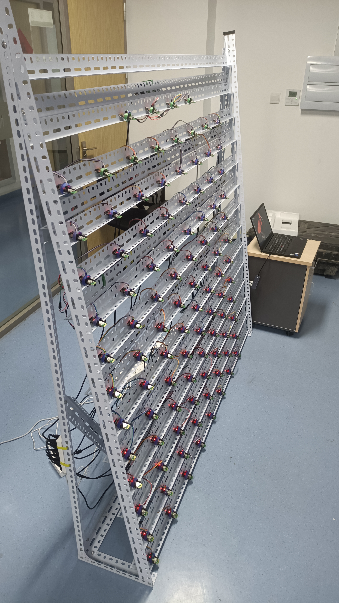

## Projects

### Wireless Battery Management System (wBMS) design using large-scale Bluetooth Low Energy (BLE) network

    

- TDMA wBMS communication protocol design based on ***BLE***
- Nanosecond-level time synchronization
- Concurrent Transmission (C.T.)
- Anti-interference design (e.g. transceiver power control)

### Energy-efficient forest fire detection acceleration solution based on wireless multimedia sensor (MDE Project)

- System-level low-energy design
- Real-time alarm transmission based on ***ZigBee and LoRa***
- Fire pre-detection based on *OpenCV*
- Deep Learning detection based on *Keras*

[Back](./)
