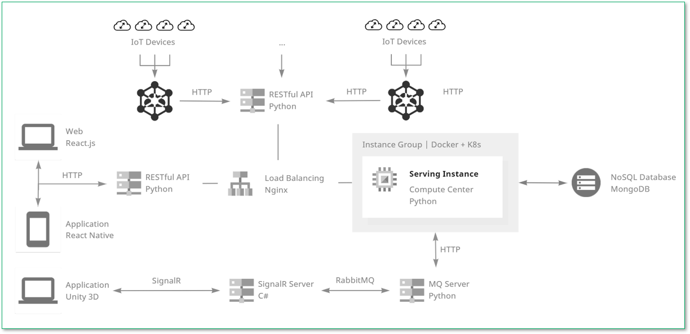

## About Me

 🏫 Electrical and Computer Engineering (ECE) B.S. @UM-SJTU JI  
 🎓 Incoming Ph.D. student majoring in Information and Communication Engineering  
 💻 Specially focus upon Wireless Networking and Communication (BLE, 5G, WiFi)  

***

## News

- **2023/06** Our paper got accepted by [EWSN'23](https://events.dimes.unical.it/ewsn2023/)!
- **2023/01** Our capstone design got accepted by SJTU with an A letter grade!

***

## Publications

### [Efficient Interference Graph Estimation via Concurrent Flooding](./)

Haifeng Jia, Yichen Wei, Zhan Wang, Jiani Jin, Haorui Li and [Yibo Pi](https://yibopi.github.io/)

International Conference on Embedded Wireless Systems and Networking (EWSN), Rende, Italy, 2023

***

## Teaching

- Teaching Assistant, VE441: App Development for Entrepreneurs [Summer 2023]

***

## Projects

### [Energy-efficient forest fire detection acceleration solution based on wireless multimedia sensor](https://drive.google.com/file/d/1if4rOR7iOwFTxU3L_Zbg1LV7aQ8YHrr8/view?usp=share_link)

Haifeng Jia, [Runxi Wang](https://misaki-rx.github.io/), Yichen Cai and [An Zou](https://sites.ji.sjtu.edu.cn/zouan/)

Major Design Experience (MDE) Project, Shanghai, China, 2022

### Fire control evaluation system design based on Big Data and Internet of Things

Haifeng Jia, Boming Zhang, Ruiqi Lai and [Mian Li](https://sites.ji.sjtu.edu.cn/ido/professor/)

SJTU Innovation and Practice Program, Shanghai, China, 2021

