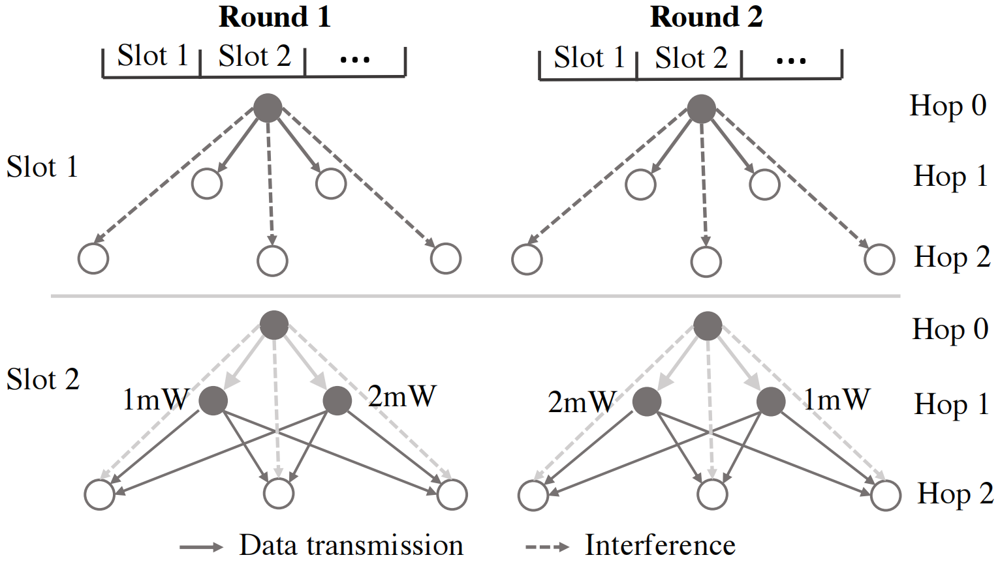

## \[About Me\]

 🏫 Electrical and Computer Engineering (ECE) B.S. @UM-SJTU JI  
 🎓 Incoming Ph.D. student majoring in Information and Communication Engineering  
 💻 Specially focus upon Wireless Networking and Communication (BLE, 5G, WiFi)  

## \[News\]

- **2023/06** Our paper got accepted by [EWSN'23](https://events.dimes.unical.it/ewsn2023/)!
- **2023/01** Our capstone design got accepted by SJTU with an A letter grade!

## \[Publications\]

### Efficient Interference Graph Estimation (IGE) via Concurrent Flooding

Haifeng Jia, Yichen Wei, Zhan Wang, Jiani Jin, Haorui Li and [Yibo Pi](https://yibopi.github.io/)

*International Conference on Embedded Wireless Systems and Networking, Italy, 2023*

    

- One of the *first* IGE works upon *wireless sensor networks*
- Implementation on [BlueFlood](https://github.com/iot-chalmers/BlueFlood) with COTS boards (nRF52840 DK)
- Real-world experiments with estimation error *median 3dB* and *80th percentile 7.5dB*

## [\[Projects\]](./projects.html)