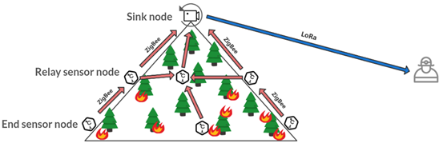

## About Me

**Currently** <iconify-icon icon="icon-park-outline:school" width="24" height="24"></iconify-icon>
 
I am a first-year Ph.D. student majoring in Information and Communication Engineering @UM-SJTU JI, advised by Prof. <a href="https://yibopi.github.io/">Yibo Pi</a>. 

**Background** <iconify-icon icon="icon-park-solid:bachelor-cap-one" width="24" height="24"></iconify-icon> 
 
I got my Electrical and Computer Engineering (ECE) B.S. also @UM-SJTU JI. 

**Research Interests** <iconify-icon icon="streamline:cellular-network-5g-solid" width="24" height="24"></iconify-icon> <iconify-icon icon="streamline:cellular-network-lte-solid" width="24" height="24"></iconify-icon><iconify-icon icon="majesticons:bluetooth-line" width="24" height="24"></iconify-icon> 

Wireless Communication Systems, Network Measurement, Sensor Networks

***

## News

- **2023/08** Selected as 2023 SJTU Outstanding Bachelor Graduate
- **2023/07** Awarded the SJTU Future Technology Taihu Scholarship
- **2023/06** Our IGE work accepted by [EWSN'23](https://events.dimes.unical.it/ewsn2023/)!
- **2023/01** MDE got full mark (4.0/4.0)!

***

## Publications

### Efficient Interference Graph Estimation via Concurrent Flooding

Haifeng Jia\*, Yichen Wei\*, Zhan Wang, Jiani Jin, Haorui Li and [Yibo Pi](https://yibopi.github.io/)

*International Conference on Embedded Wireless Systems and Networking, Rende, Italy, 2023*

[<iconify-icon icon="ph:link-fill" width="32" height="32"></iconify-icon>](https://arxiv.org/abs/2312.16807)
[<iconify-icon icon="mdi:file-pdf-box" width="32" height="32"></iconify-icon>](./assets/pdf/EWSN_23_camera_ready.pdf) 
[<iconify-icon icon="simple-icons:slides" width="32" height="32"></iconify-icon>](./assets/pdf/ewsn_haifeng_static.pdf)

### Power-Domain Interference Graph Estimation for Multi-hop BLE Networks [*Under Review*]

Haifeng Jia, Yichen Wei, [Yibo Pi](https://yibopi.github.io/) and [Cailian Chen](https://english.seiee.sjtu.edu.cn/english/detail/386_581.htm)

*ACM Transactions on Sensor Networks, submitted in December 2023*

***

## Teaching

- Teaching Assistant, VE441: App Development for Entrepreneurs [Summer 2023]
- Teaching Assistant, VE281: Data Structures and Algorithms [Fall 2021]

***

## Projects

### Energy-efficient forest fire detection acceleration solution based on wireless multimedia sensor 

Haifeng Jia, [Runxi Wang](https://misaki-rx.github.io/), Yichen Cai and [An Zou](https://sites.ji.sjtu.edu.cn/zouan/)

*Major Design Experience (MDE) Project, Shanghai, China, 2022*

[<iconify-icon icon="ri:video-fill" width="32" height="32"></iconify-icon>](https://drive.google.com/file/d/1if4rOR7iOwFTxU3L_Zbg1LV7aQ8YHrr8/view?usp=share_link)

